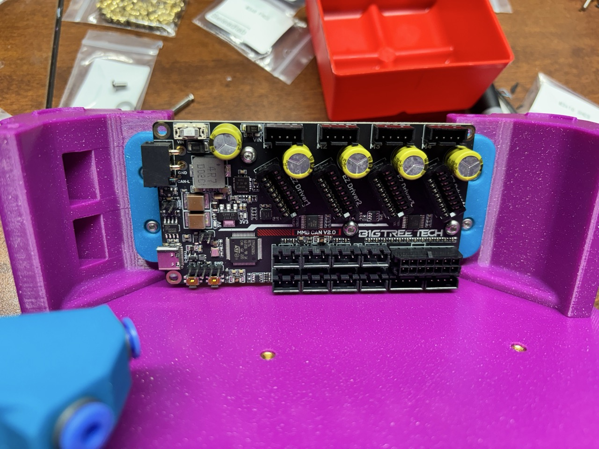

# Mount for BTT MMB 2.0 MCU

### Print Settings

All parts have been pre-oriented for support-free printing or include integrated supports. Print using the recommended Voron settings:

- Layer height: 0.2mm.
- Extrusion width: 0.4mm, forced.
- Infill percentage: 20%
- Infill type: grid, gyroid, honeycomb, triangle, or cubic.
- Wall count: 4
- Solid top/bottom layers: 5
- Supports: **NONE*
