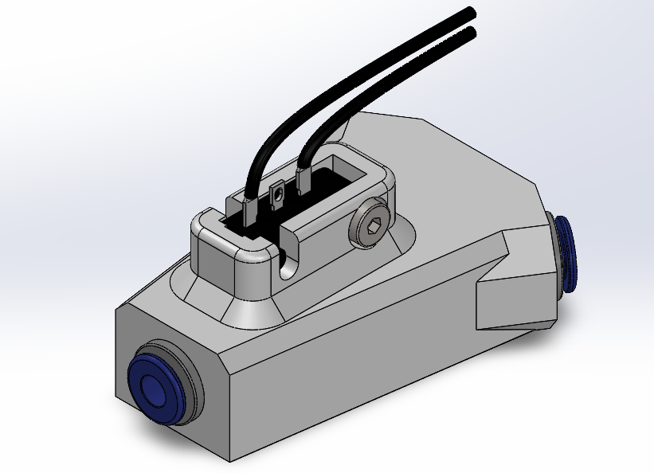
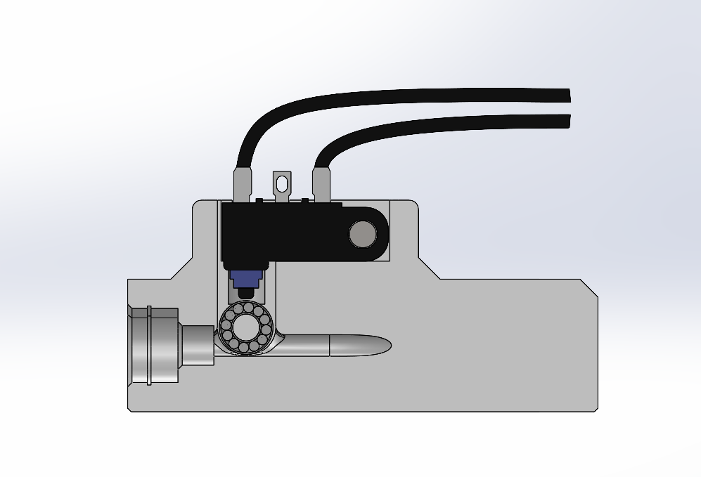

# D2HW Hub for the Night Owl AFC

## A more reliable sensed Hub

Due to issues with the D2F hub and the 5.5mm Ball Bearing and them not always sensing the filament, I have created a hub based on the Box Turtle D2HW and MR63ZZ bearing method which is a lot more reliable. This will always trigger due to the short trigger and long stroke of the D2HW switch with the MR63ZZ bearing being 0.2mm from the bottom of the filament path.

### Print Settings

All parts have been pre-oriented for support-free printing or include integrated supports. Print using the recommended Voron settings:

- Layer height: 0.2mm.
- Extrusion width: 0.4mm, forced.
- Infill percentage: 20%
- Infill type: grid, gyroid, honeycomb, triangle, or cubic.
- Wall count: 4
- Solid top/bottom layers: 5
- Supports: **NONE*

## Assembly

### Bill of Materials

- 1x [D2HW-C201H Switch](https://www.aliexpress.com/item/1005001866383478.html)
- 1x [MR63ZZ bearing](https://www.aliexpress.com/item/1005002121057437.html) - [MR63ZZ - Viper Worx](https://www.viperworx.uk/product/mr63zz-bearing)
- 3x [ECAS-04 Bowden Collet](https://www.aliexpress.com/item/1005006618335984.html) - [ECAS-04 - Viper Worx](https://www.viperworx.uk/product/ecas04-bowden-collet)
- 2x [M3x5x4 Heat Set Insert](https://www.aliexpress.com/item/1005003582355741.html) - [M3x5x4 Heat Set Insert - Viper Worx](https://www.viperworx.uk/product/heat-set-inserts-m3x5x4)
- 1x M3x10 Socket Head Cap Screw

## Acknowledgements

 - Robert Klotz [ArmoredTurtle](https://github.com/ArmoredTurtle) for the idea of using a D2HW switcha and MR63ZZ Bearing for sensing filament. 