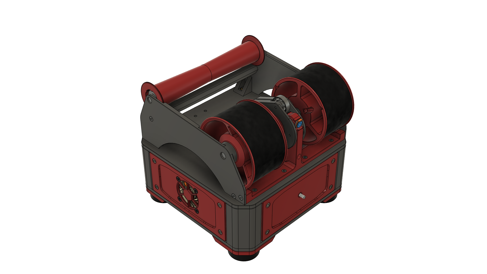
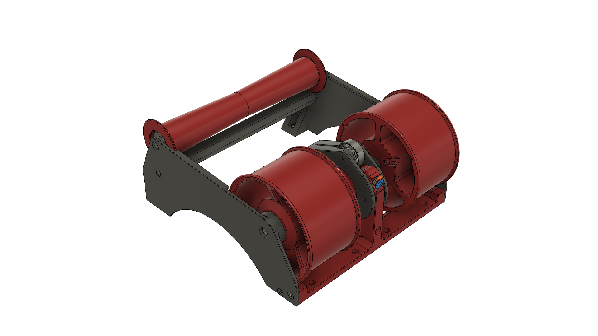
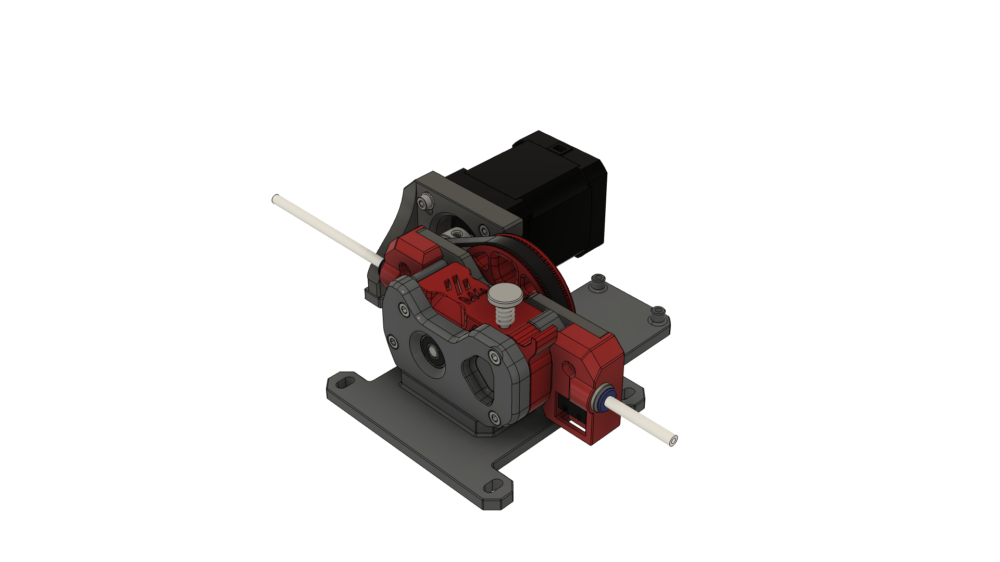

# NightOwl XL 

Modified parts for a single lane NightOwl that can support most 3-5kg spools.

## Summary

- XL Filamentalist that fits on the regular NightOwl top plate instead of the two 1kg versions
- Voron M4 Extruder, with entry & exit filament runout sensors
- Single lane front and rear skirts for M4 extruder

### Print Settings

All parts have been pre-oriented for support-free printing or include integrated supports. Print using the recommended Voron settings:

- Layer height: 0.2mm.
- Extrusion width: 0.4mm, forced.
- Infill percentage: 40%
- Infill type: grid, gyroid, honeycomb, triangle, or cubic.
- Wall count: 4
- Solid top/bottom layers: 5
- Supports: **NONE**

The skirts have been provided as 3MF files with the correct settings applied for PrusaSlicer. Follow the main printing instructions should you want/need to modify the settings.

## Assembly

### Bill of Materials

There may be a few assorted, but standard-sized screws and heatsets missing from the following lists:

**Filamentalist XL**

With the exception of the axle rods and additional bearings for the idler roller, the necessary hardware for the Filamentalist XL is identical to a normal Filamentalist.

- 2x 8mmx180mm steel rod - [Amazon 1](https://www.amazon.com/dp/B09RVS4PXZ), [Amazon 2](https://www.amazon.com/dp/B0CX1H77FV)
- 2x HK0810 needle roller bearing (for regular idler roller) - [Amazon](https://www.amazon.com/dp/B07GC8VTPV)
- 2x 688-2RS bearing (for alternative idler roller) - [Amazon](https://www.amazon.com/dp/B082PQ3SC4)

**M4 Extruder**

In addition to the standard M4 hardware, the runout sensors require:

- 2x D2F switch - [Amazon](https://www.amazon.com/dp/B088W8WMTB)
- 2x 5.5mm ball bearing ball - [Amazon](https://www.amazon.com/dp/B09DSH1GL6)

## Images

## Acknowledgements

The modified M4 extruder is based on the excellent work of VORON Design and was done in cooperation with [hartk](https://github.com/hartk1213). 

## Changelog

- 2025-03-13 Initial Release

## License

This work is licensed under the GNU General Public License v3.0, for more details check the [LICENSE](../../LICENSE).
