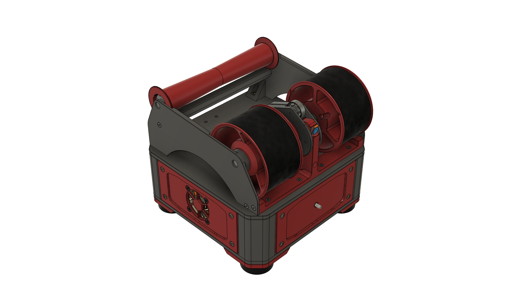
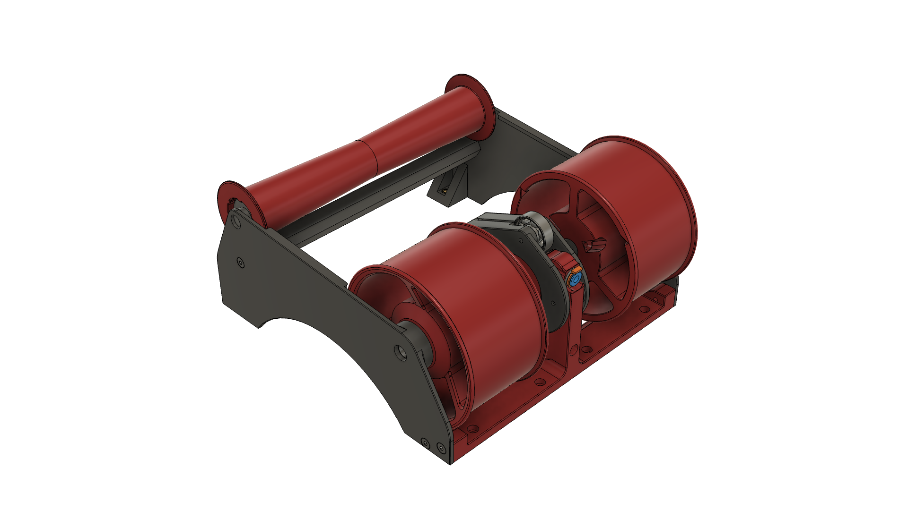
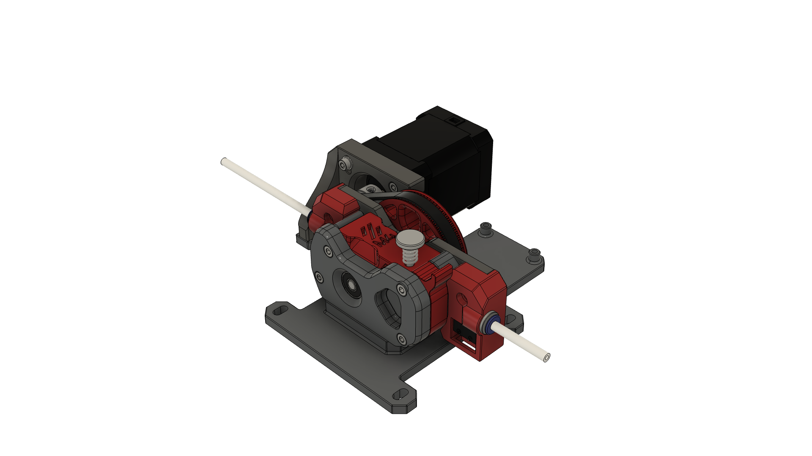

# NightOwl XL 

Modified parts for a single lane NightOwl that can support most 3-5kg spools.

## Summary

- XL Filamentalist that fits on the regular NightOwl top plate instead of the two 1kg versions
- Voron M4 Extruder, with entry & exit filament runout sensors
- Single lane front and rear skirts for M4 extruder

### Print Settings

All parts have been pre-oriented for support-free printing or include integrated supports. Print using the recommended Voron settings:

- Layer height: 0.2mm.
- Extrusion width: 0.4mm, forced.
- Infill percentage: 40%
- Infill type: grid, gyroid, honeycomb, triangle, or cubic.
- Wall count: 4
- Solid top/bottom layers: 5
- Supports: **NONE**

The skirts have been provided as 3MF files with the correct settings applied for PrusaSlicer. Follow the main printing instructions should you want/need to modify the settings.

## Assembly

### Bill of Materials

Please refer to the [Bill of Materials](./BOM.md) for a list of parts needed for the spool holder. This BOM includes all non-printed parts needed for the build including the Filamentalist XL and M4 Extruder.

## Images

## Acknowledgements

The modified M4 extruder is based on the excellent work of VORON Design and was done in cooperation with [hartk](https://github.com/hartk1213). 

## Changelog

- 2025-03-13 Initial Release

## License

This work is licensed under the GNU General Public License v3.0, for more details check the [LICENSE](../../LICENSE).
