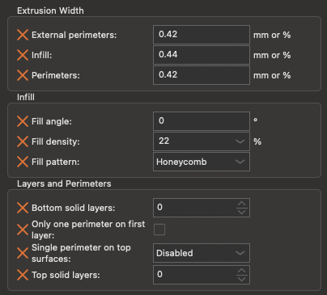

# NightOwl: Integrated Dual Spool Filament Switching System

NightOwl is an enclosure that integrates multiple projects' technologies into a dual-spool filament switching system.

## Summary

The goal of the NightOwl enclosure is to create a simple, universal filament switching solution that accommodates two primary usage styles: standalone units with integrated rewinding filament spool holders, or backpack-style units mountable to a printer, fed from separate spool rollers. A secondary objective was to design a mostly self-contained setup requiring only a 24V power supply and either a USB or CAN connection.

To achieve this, NightOwl integrates the following projects:

- Hartk's [Dual Nightwatch](https://github.com/hartk1213/MISC/tree/main/Voron%20Mods/Extruders/Dual_Nightwatch): a compact dual Bowden extruder based on the Voron Nightwatch
- Hartk's [Bowden Y-Splitter](https://github.com/hartk1213/MISC/tree/main/Voron%20Mods/Extruders/Dual_Nightwatch/STLs/Bowden_Y)
- [Filamentalist Rewinder - 80mm Axle](https://github.com/Enraged-Rabbit-Community/ERCF_v2/tree/master/Recommended_Options/Filamentalist_Rewinder) from the Enraged Rabbit Community
- Fysetc [ERB 2.0 MCU](https://github.com/FYSETC/FYSETC-ERB/tree/main/V2.0)
- Annex Engineering's [Belay](https://github.com/Annex-Engineering/Belay) Extruder Sync Sensor
  Alternatives:
  - [TurtleNeck](https://github.com/ArmoredTurtle/TurtleNeck) syncing toolhead buffer
  - The [ERCF Filament Stress Sensor](https://www.printables.com/model/803180-voron-ercf-filament-stress-sensor)

Besides these parts you'll also want an extruder that has both a toolhead and an entry sensor. Some options for this are:

- [Clockwork 2](https://github.com/Enraged-Rabbit-Community/ERCF_v2/tree/master/Recommended_Options/Toolhead_Modifications/Stls)
- [WristWatch G2](https://github.com/bythorsthunder/Voron_Mods/tree/main/Wristwatch_G2_Dual_Filament_Sensor/STLs)

## Printing

Print the following components for the NightOwl.

- 1x Base plate
- 3x Blank Corner
- 1x Connector Corner
- 1x Connector Insert for your choice of connectors
- 1x Top Plate of choice (80mm Filamentalist or Backpack )
- 1x Y-Splitter Mount
- 4x Skirts
  - Front
  - Back
  - Left
  - Right
- 4x Feet (if using the Filamentalist top)
- 4x Knobs (if using the Backpack top)

## Other parts to print

- [Dual Nightwatch](https://github.com/hartk1213/MISC/tree/main/Voron%20Mods/Extruders/Dual_Nightwatch/STLs/Dual_Nightwatch)
  - Use the 2-part guidler, it has proven more reliable than the single piece guidler
  - Prefer the mid body with collets for improved reliability
- [Y-Splitter](https://github.com/hartk1213/MISC/tree/main/Voron%20Mods/Extruders/Dual_Nightwatch/STLs/Bowden_Y)
  - Only print the mid body and the rear cover
- [Filamentalist](https://github.com/Enraged-Rabbit-Community/ERCF_v2/tree/master/Recommended_Options/Filamentalist_Rewinder)
  Print these parts per Rewinder:
  - 1x Right Support
  - 1x Left Support
  - 1x Base Plate (80mm)
  - 1x Idler Roller Axle (80mm)
  - 2x Rim Roller (80mm)
  - 1x Center Drive Roller
  - 2x CDR Spacer
  - 1x Tensioner Arm Left
  - 1x Tensioner Arm Right
  - 1x Tensioner Mount (80mm)
  - 1x Idler Roller (male - 80mm)
  - 1x Idler Roller (female - 80mm)
  - 1x Axle Depth Tool (80mm)

### Print Settings

All parts have been pre-oriented for support-free printing or include integrated supports. Print using the recommended Voron settings:

- Layer height: 0.2mm.
- Extrusion width: 0.4mm, forced.
- Infill percentage: 40%
- Infill type: grid, gyroid, honeycomb, triangle, or cubic.
- Wall count: 4
- Solid top/bottom layers: 5
- Supports: **NONE**

The skirts have been provided as 3MF files with the correct settings applied for PrusaSlicer. However, if your slicer does not support importing these settings, open the 3MF in geometry-only mode and change the type of the inlay/mesh modifier part to 'Modifier'. Then, configure the modifier settings as follows for optimal print results:

## Assembly

Please refer to the [Bill of Materials](./BOM.md) for a list of parts needed for the enclosure. Additionally, check the projects listed in the summary for specific parts requirements.

### Step-by-Step Assembly

1. Insert 16 Voron-spec heatset inserts into skirt mounting points.
2. Install 4 heatset inserts into the top of the base plate pillars.
3. Install 4 heatset inserts into Dual Nightwatch mounting holes.
4. Install 2 heatset inserts into the filament splitter mount.
5. Install 4 heatset inserts into MCU mounting holes (CI corner and the CB corner below it)
6. Install 4 heatset inserts into the top panel:
   1. Either into the 4 mounting points for Filamentalist Rewinders.
   2. Or into the 4 knobs for the backpack top panel.
7. Install 8 heatset inserts into the bottom side of the corners
8. Assemble the corners and the base plate - pay attention to where the corners go (CB / CI markers)
   1. Drop a M5 hexnut into the recess in the base plate
   2. Join the base plate, foot and corner parts using M3x12 SHCS screws
   3. Install the rubber foot using an M5x16 or M5x20 screw. Use a washer if needed to not pierce the corner top surface.
9. Remove the integrated support from the connector openings in the corners.
10. Install the MCU Base plate between the two right corners
11. Install the ERB 2.0 MCU into the base plate. The M3 screws thread into the plastic.
12. Install the blank skirt on the side with the MCU.
13. Install the 40mm axial fan (10-20mm depth verified) into the fan skirt and mount it to the opposite side of the MCU.
14. Install the Dual Nightwatch onto the base plate.
15. Install two ECAS connectors into the skirt with filament inlets; be mindful of force to avoid damaging the honeycomb pattern.
16. Install the filament inlet skirt in the base plate; feed in PTFE tube from outside until securely seated in the Dual Nightwatch.
17. Install the filament splitter mount; route the Belay tension sensor cable/connector outside through the mount.
18. Assemble the filament splitter; connect it to the Dual Nightwatch using two PTFE tube lengths. Adjust tube length for flush mounting.
19. Attach the skirt with the filament outlet to the base plate.
20. Install 10x3 countersunk magnets into the base plate and top panel. Monitor screw length to avoid damaging prints.
    Note: For 2.6mm magnets, use M3 washers as shims.
21. If using spool holders, mount them with 4 FHCS screws from the top panel's bottom and 4 SHCS screws into heatset inserts.
22. Finally, wire up the XT30 2+2 connector and test everything before installing it into the base plate.

## Images

Soon(tm)

## Acknowledgements

The NightOwl project builds upon open-source innovations, drawing inspiration from the [BoxTurtle](https://github.com/ArmoredTurtle) project. While influenced by BoxTurtle's design philosophy, NightOwl distinguishes itself through deliberate design choices: minimal footprint, dual-channel limitation and leveraging off-the-shelf components.

## Changelog

- 2024-10-18 NightOwl Beta.1 (Crafty Crow)
  - Simplified the corners
    - Switch to an insert base approach for connectors
    - Single blank corner with universal mounting holes
    - Moved all connectors to the "back"
  - Added markers to the bottom plate where the various corners go
  - Added hints to parts printing for Nightwatch and Y-Splitter
  - Updated Bill of Materials with more sourcing links
- 2024-10-07 NightOwl Alpha.2 (Brawny Beaver)
  - Bill of Materials added
  - Increased height of enclosure by 4mm
  - Revised MCU mount to add support for BTT MMB 1.0 MCU
  - Added the option to use compressor feet
  - Updated to the latest dual nightwatch release (v16)
  - Moved MCU connectors to the back by default
    - Optional corners are provided to use XT30 2+2 or MicroFit 3.0 for the MCU connection
    - Optional corners to keep the MCU connection in the front corner (for backpack style use)
- 2024-09-25 NightOwl Alpha.1 (Ambitious Alpaca)

## License

This work is licensed under the GNU General Public License v3.0, for more details check the [LICENSE](./LICENSE).
