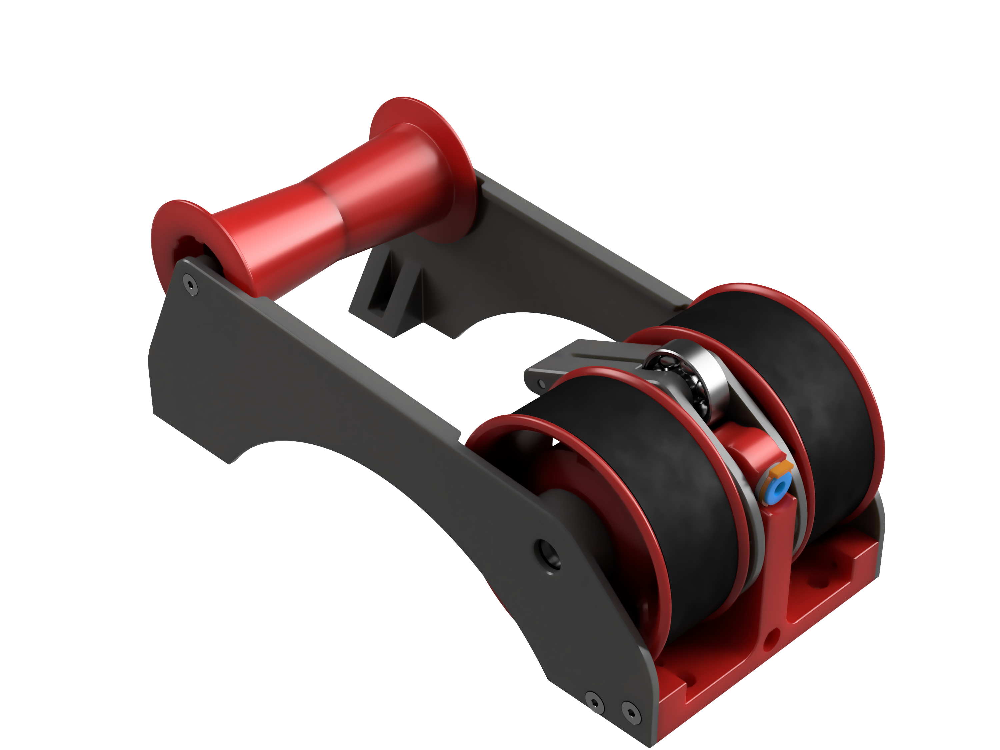

# The "Filamentalist" Passive Filament Driven Rewinder

This folder contains STL files tailored for the NightOwl use of the Filamentalist, featuring adjusted parameters to accommodate spools up to 74mm wide (versus the standard 68mm), without requiring hardware modifications.

## Attention

- Only the necessary files for the NightOwl project are provided here.
- File naming conventions adhere to Voron standards.
- Quantities in file names are set to print a pair of Filamentalist rewinders.

## Parameters for Export

The export parameters are listed in the [ExportedParameters](./Parameters/ExportedParameters.csv) file. You can import these parameters into Fusion 360 for further adjustments.

## Original Source

Find the Filamentalist CAD and unmodified files in the [ERCFv2](https://github.com/Enraged-Rabbit-Community/ERCF_v2/tree/master/Recommended_Options/Filamentalist_Rewinder) GitHub repository: (link unavailable). These files in this directory were exported from CAD version 3.0.5.
